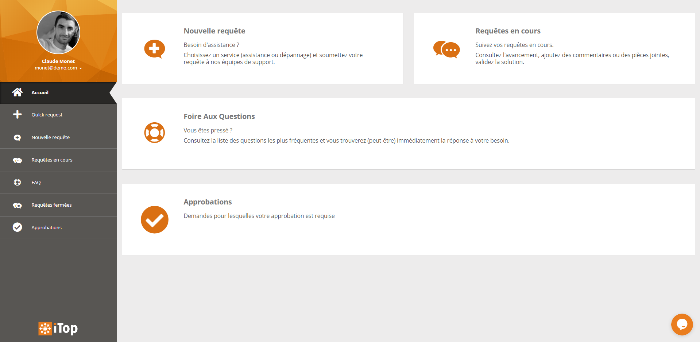
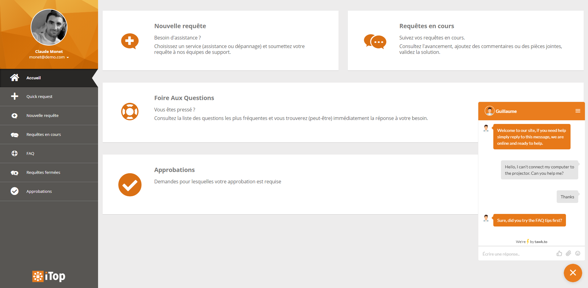
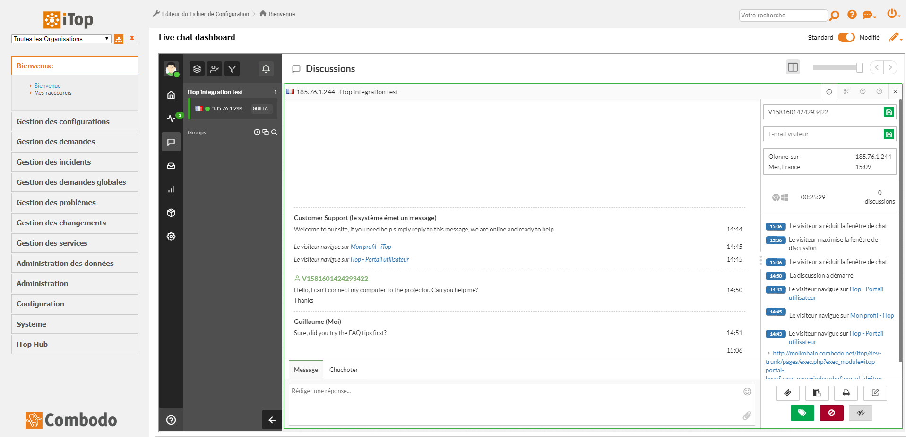

# Tawk.to chat integration

_Note: Prototype to show how to integrate a third-party chat(bot) in iTop through the existing APIs._

## Description
[Tawk.to](https://www.tawk.to/) is a free, hosted, third-party, live support chat that can be easily integrated within iTop to offer a new contact channel. It's a perfect way to enable live chat in iTop with a minimal effort/investment.

## Features
It brings a small bubble in the bottom-right corner of the screen. Users can click on it to start a conversation with support agents.

_Note: Chat can be enabled in any end-user portals or the backoffice through its configuration._





Combined with the _iFrame dashlet_, the agent dashboard can be embedded in the admin. console to answer chats directly from iTop.



## Compatibility
Compatible with iTop 2.7+

## Configuration
### Get tawk.to account
Go to [tawk.to](https://www.tawk.to/), create a free account and that's it!

### Set widget configuration
First, go to the tawk.to backoffice and retrieve the `Site ID`. Once you got it, open the iTop configuration file and fill the module settings as follow:
- `site_id` Put the site ID retrieve in the previous step.
- `enabled_portals` An array of the "portals" you want the chat to be enabled on. Can be `backoffice` for the admin. console or any end-user portal ID (eg. `itop-portal` for the standard portal).
- `allowed_profiles` An array of iTop profiles to define which users will be able to use the chat. If not defined, all users will be able t use it.

### Configuration example
```
'combodo-tawk-integration' => array (
    'site_id' => 'somesiteidforyourcopany',
    'enabled_portals' => array (
      'itop-portal',
    ),
    'allowed_profiles' => array('Portal user'),
),
```
