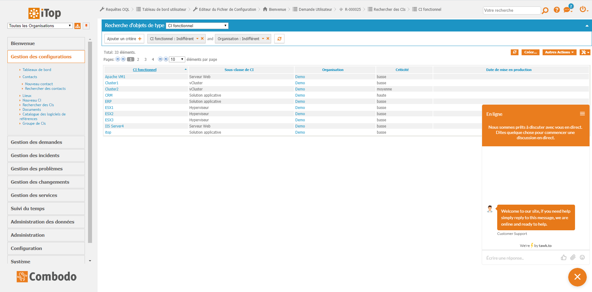
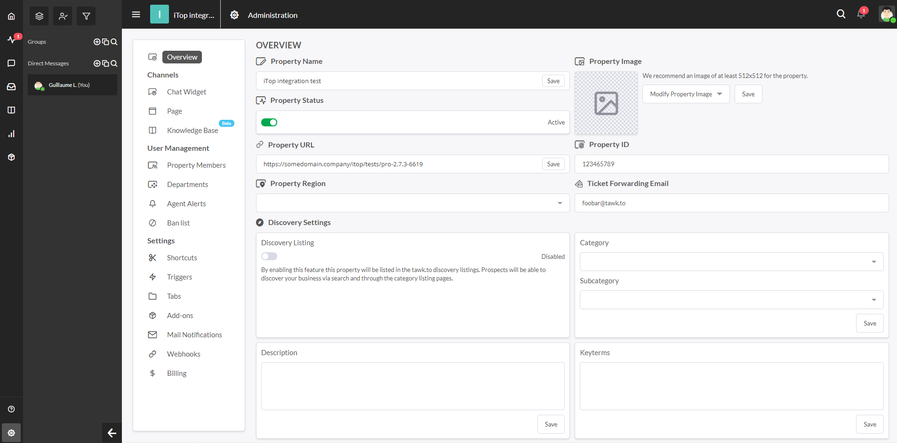
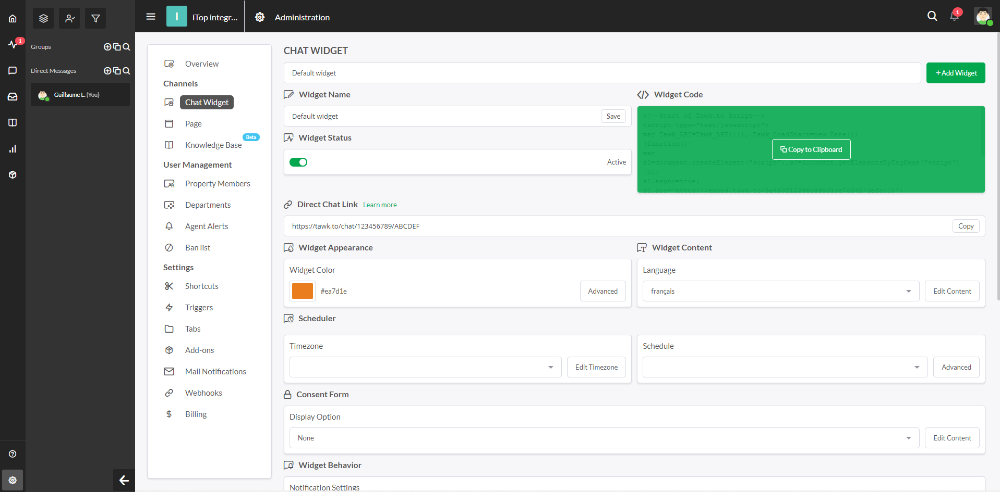
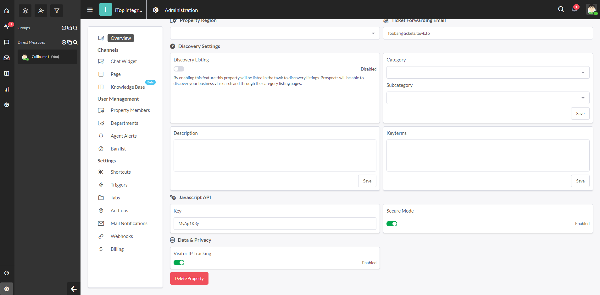

# Tawk.to chat integration

_Note: Prototype to show how to integrate a third-party chat(bot) in iTop through the existing APIs._

## Description
[Tawk.to](https://www.tawk.to/) is a free, hosted, third-party, live support chat that can be easily integrated within iTop to offer a new contact channel. It's a perfect way to enable live chat in iTop with a minimal effort/investment.

## Features
It brings a small bubble in the bottom-right corner of the screen. Users can click on it to start a conversation with support agents.


Note that the chat widget can also be enabled in the backoffice.



**Important:** Unfortunately, embedding the agents dashboard in iTop through an iFrame dashlet is no longer possible as they have shutdown this feature.

## Compatibility
Compatible with iTop 2.7+

## Configuration
### Get tawk.to account
Go to [tawk.to](https://www.tawk.to/), create a free account and that's it!

### Set widget configuration
First, go to the tawk.to backoffice, on the "Administration" page, "Overview" tab and retrieve the `Property ID` ("123456789" in the screenshot below) we will use it later.



Then, go to the "Chat Widget" tab and retrieve the `Widget ID`, it's the last part of the `Direct Chat Link` ("ABCDEF" in the screenshot below)



Once you got them, fill the module settings as follow:
- `property_id` Put the property ID retrieve in the previous step.
- `widget_id` Put the widget ID retrieve in the previous step.
- `enabled_portals` An array of the "portals" you want the chat to be enabled on. Can be `backoffice` for the administration console or any end-user portal ID (eg. `itop-portal` for the standard portal), by default only the `itop-portal` is enabled.
- `allowed_profiles` An array of iTop profiles to define which users will be able to use the chat. If not defined, all users will be able t use it, by default only `Portal user` is allowed.

The extension comes with default settings in its XML datamodel (_module parameters_), you can either:
- Overload them with your XML delta (Good to propagate settings to all your iTop instances)
- Overload them in iTop's configuration file (Good to change setting only on a specific instance)

**Important:** "Property ID" was once named "Site ID" on tawk.to, mind to change the `site_id` parameter to `property_id`.

##### Default configuration in the datamodel
```
<?xml version="1.0" encoding="UTF-8"?>
<itop_design xmlns:xsi="http://www.w3.org/2001/XMLSchema-instance" version="1.6">
	<module_parameters>
		<parameters id="combodo-tawk-integration" _delta="define">
			<property_id>PUT_YOUR_PROPERTY_ID_HERE</site_id>
			<widget_id>PUT_YOUR_WIDGET_ID_HERE</widget_id>
			<api_key>PUT_YOUR_API_KEY_HERE</api_key>
			<enabled_portals type="array">
				<enabled_portal id="itop-portal">itop-portal</enabled_portal>
			</enabled_portals>
			<allowed_profiles type="array">
				<allowed_profile id="portal-user">Portal user</allowed_profile>
			</allowed_profiles>
		</parameters>
	</module_parameters>
</itop_design>
```

##### Overloading through the configuration file
Simply put the following in the configuration file and fill it with your own settings:
```
'combodo-tawk-integration' => array (
    'property_id' => 'some_property_id_of_your_company',
    'widget_id' => 'widget_you_want_to_use',
    'api_key' => 'javascript_api_key_for_secure_mode',
    'enabled_portals' => array (
      'itop-portal',
    ),
    'allowed_profiles' => array(
      'Portal user',
    ),
),
```

##### Using the secure mode
Tawk.to provides a secure mode to ensure that a user identify isn't impersonated. If you want to use it, go to their backoffice in the éAdministration" page, "Overview" tab and activate the "Secure mode".
Then copy the `Javascript API Key` ("MyAp1K3y" in the screenshot below), then put it in the `api_key` of the extension settings (see previous section).

